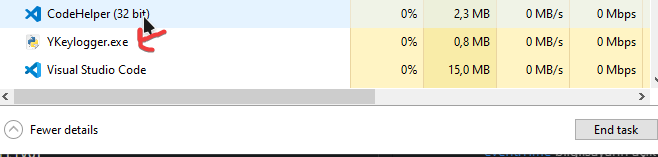

# KeyloggerPY <!-- omit in toc -->

Klavye basımlarını raporlayan araç.

> Lütfen, o düşündüğünüz işler için kullanmayın 😅

## İçerikler <!-- omit in toc -->

- [Kullanım Şekli](#Kullan%C4%B1m-%C5%9Eekli)
- [Kurulum Aşamaları](#Kurulum-A%C5%9Famalar%C4%B1)
- [Faydalı Notlar](#Faydal%C4%B1-Notlar)
- [Hata Çözümleri](#Hata-%C3%87%C3%B6z%C3%BCmleri)
  - [Cannot import 'pywintypes' Çözümü](#Cannot-import-pywintypes-%C3%87%C3%B6z%C3%BCm%C3%BC)
  - [\` Gibi özel karakterlerin oluşturulamaması](#Gibi-%C3%B6zel-karakterlerin-olu%C5%9Fturulamamas%C4%B1)
- [Harici Linkler](#Harici-Linkler)
- [Destek ve İletişim](#Destek-ve-%C4%B0leti%C5%9Fim)

## Kullanım Şekli

- **Release** kısmından `exe`'li sürümünü indirin
- <kbd>WINDOWS</kbd> + <kbd>R</kbd> kısayoluna basıp `shell:startup` yazın <kbd>ENTER</kbd>'a basın
- Çıkan dizine `exe`'li dosyayı yerleştirin
- Bu sayede PC her açıldığında aktif olacaktır
- Rapolamayı `~\Documents\Keylogs` dizinine yapar

> Kapatmak için görev yöneticisini kullanın

## Kurulum Aşamaları

Python'ın `pip install -r requirements.txt` komutu ile gerekli paketleri indirebilirsin

- [Python 3.7], Programın yazılma dili 🙄
- [PyWinHook], Klavye'ye bağlanmak için kullanılır
- [PyGame], klavyeyi dinlemek için kullanılır

## Faydalı Notlar

Sakın ama sakın eskimiş `pywin32` ve `pyHook` modüllerini kullanma ⚠

- [Son çıkan sürüm]
- Log yapısı için koddaki `parseData`'ya bakın
- [event.Time](https://stackoverflow.com/a/40049296/9770490) bilgilsayarın açık olma süresi imiş 😢
- `logging` paketi yerine `file.flush()` kullanılıyor
- Özel karakterin 2'li yazılma sorununu gidermek için `pythoncom` yerine `pygame` modülü üzerinden `pump` yapıldı
- [auto-py-to-exe] ile `exe` oluşturabilirsin

> [PyHook] tuş algılanmalarında çok fazla probleme sebep olduğundan [PyWinHook] ile değiştirildi.

## Hata Çözümleri

### Cannot import 'pywintypes' Çözümü

- Python'ın kurulu olduğu dizinde `site-packages\pywin32_system32` dizininin içindekileri `C:\Windows\System32`'ye kopyalayın.
- Biliyorum korkutucu ama yapmak zorundayız 😅

> [Cannot import 'pywintypes'](https://github.com/nicoddemus/pywin32-feedstock/commit/4366b982e499dbb5320c937620c616762d83a2c9)

### \` Gibi özel karakterlerin oluşturulamaması

PyWinHook her tıklama başına çalıştığından, 2li kombinasyonlarda sorun oluşmakta 😥

- `pythoncom` yerine `pygame` modülü üzerinden `pump` işlemleri yapılmalı
- Klavyeyi değiştirip eski haline alınca düzelir (_TR - EN, EN - TR_)

> Stackoverflow cevabım için [buraya](https://stackoverflow.com/a/56776934/9770490) bakabailirsin.

## Harici Linkler

- [Keyboard](https://pypi.org/project/keyboard/)
- [PumbMessage yerine asenkron hooklama](https://stackoverflow.com/a/14249096/9770490)
- [CTRL + C'ye tepki verme (Çoklu tuş Algılama)](https://stackoverflow.com/questions/4581772/using-pyhook-to-respond-to-key-combination-not-just-single-keystrokes/4905495)
- [Bazı tuşları bloklama](http://code.activestate.com/recipes/553270-using-pyhook-to-block-windows-keys/)
- [Keylogger Örneği](https://www.logixoft.com/en-eu/index)

[pygame]: https://pypi.org/project/pygame/
[pyhook]: https://www.lfd.uci.edu/~gohlke/pythonlibs/#pyhook
[pywinhook]: https://www.lfd.uci.edu/~gohlke/pythonlibs/#pywinhook
[pywin32]: https://pypi.org/project/pywin32/
[pywin32-conda]: https://github.com/nicoddemus/pywin32-feedstock
[python 3.7]: https://www.python.org/downloads/windows/

## Destek ve İletişim

**The [MIT License](https://choosealicense.com/licenses/mit/) &copy; Yunus Emre Ak**

[][github]
[][linkedin]
[][website]
[][mail]
[][bağış anlık]

[][bağış aylık]

<!-- İletişim -->

[mail]: mailto::yedhrab@gmail.com?subject=YBilgiler%20%7C%20Github
[github]: https://github.com/yedhrab
[website]: https://yemreak.com
[linkedin]: https://www.linkedin.com/in/yemreak/
[bağış anlık]: https://gogetfunding.com/yemreak/
[bağış aylık]: https://www.patreon.com/yemreak/

<!-- İletişim Sonu -->

[son çıkan sürüm]: https://github.com/yedhrab/YAnalyser/releases/tag/v1.0.0
